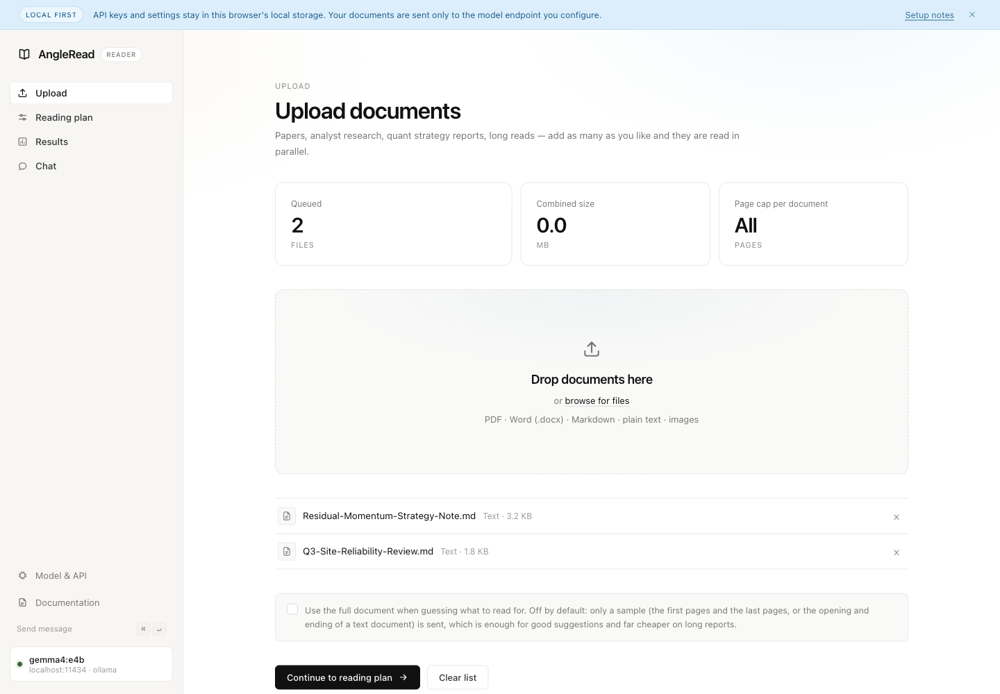
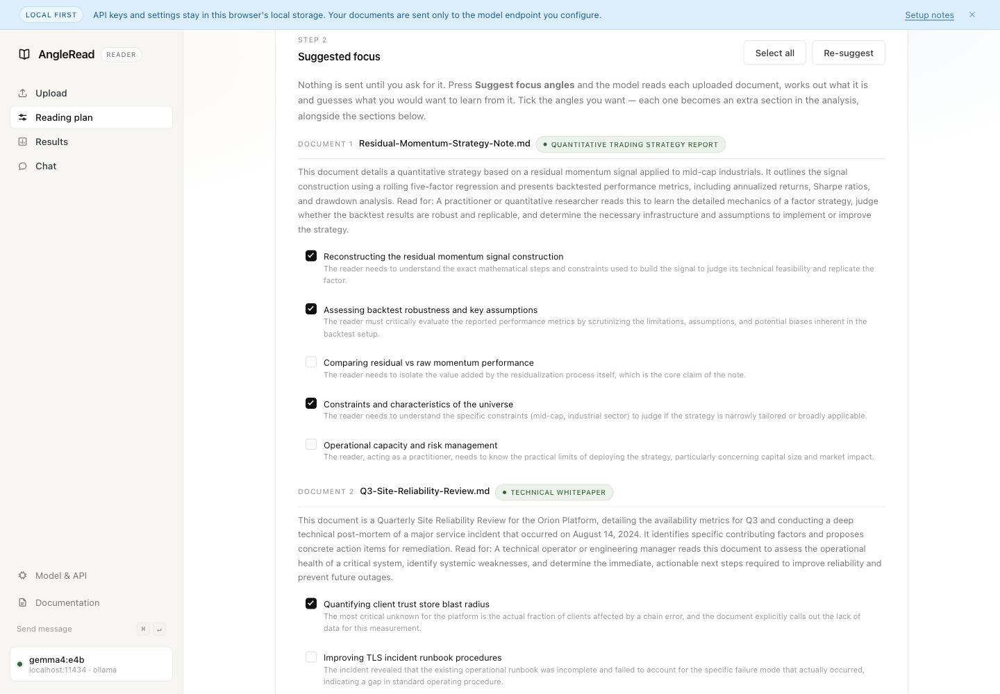
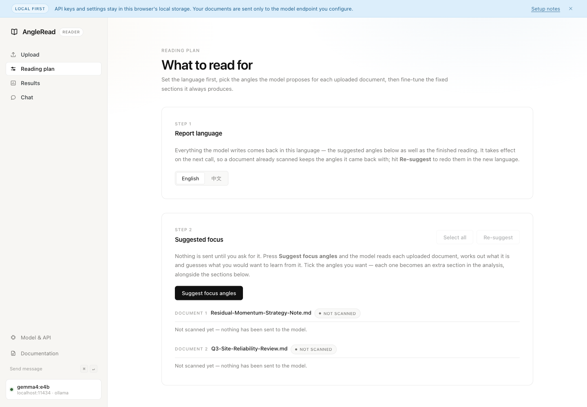
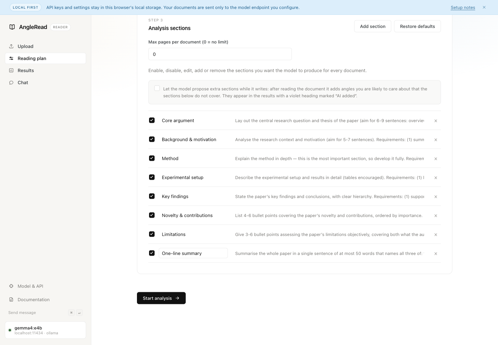
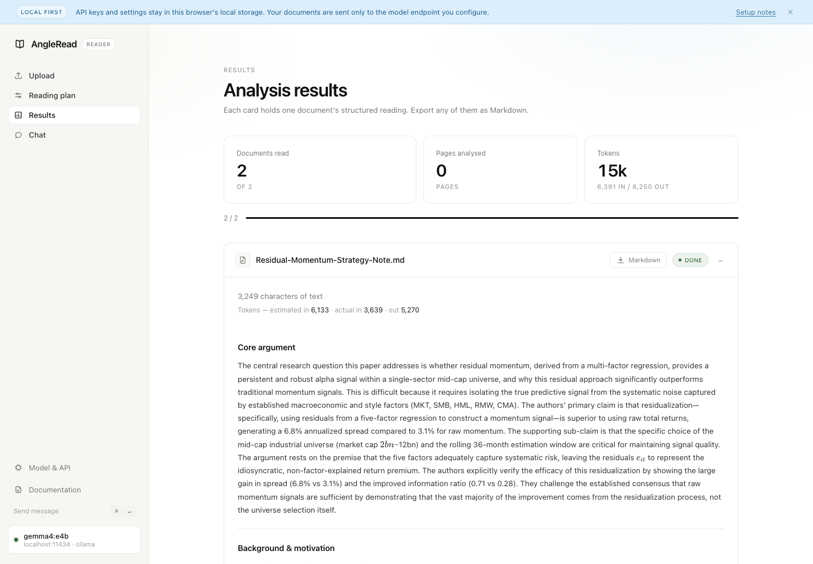
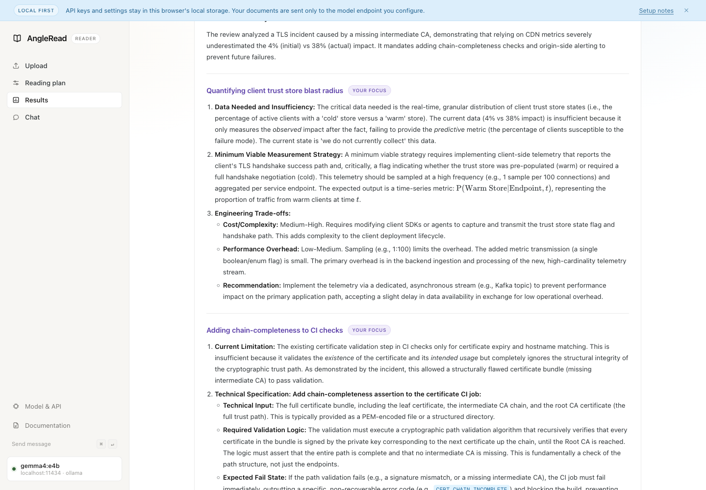
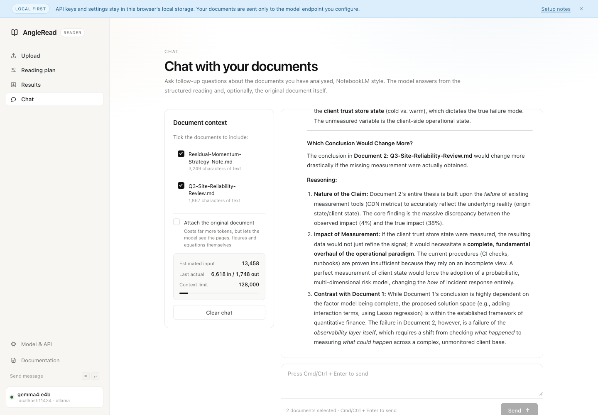
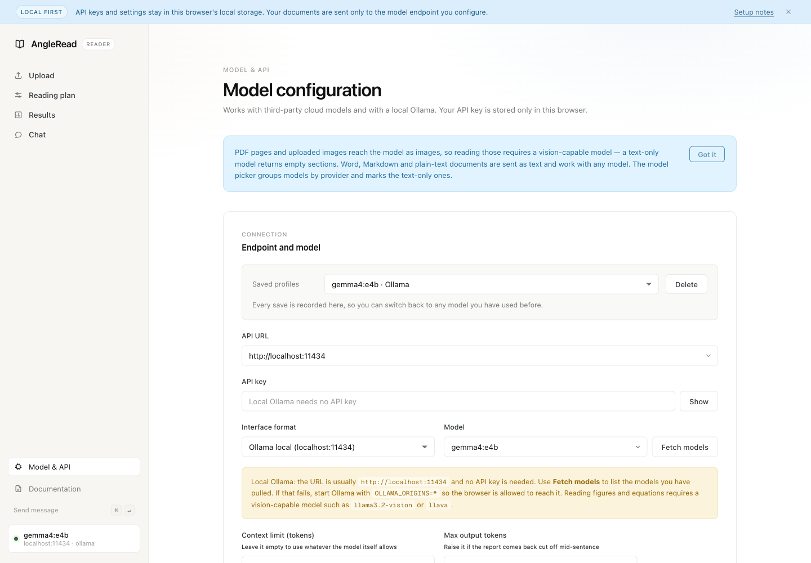

<div align="center">

# AngleRead

**The model works out what you would want from a document — then reads it for you.**

[](LICENSE)


**English** · [简体中文](README.zh-CN.md)

</div>

---

Upload a paper, an analyst note, a strategy report or an incident review. Before it
analyses anything, AngleRead asks the model a different question first: *who opens a
document like this, and what do they need out of it?* You get back a list of candidate
reading angles specific to your file — tick the ones you care about, and they become
extra sections in the finished reading.

It is a single-page app with no build step, no server and no account. Your API key lives
in your browser's local storage; your documents go to the model endpoint you configure
and nowhere else.



## Why the extra step

Most "summarise this PDF" tools apply the same template to every document. AngleRead
starts from the reader instead: it identifies what kind of document it is holding, states
in one sentence why someone would read it, and derives the questions from that motive.

Four genres ship with a ready-made question list — sell-side research, quant strategy
reports, long-form investigative journalism, and finance papers. Anything else (earnings
decks, call transcripts, prospectuses, whitepapers, policy reports, postmortems…) gets a
list reasoned out from scratch by the same procedure.

The judgement it makes is visible in the UI, so you can tell at a glance whether it
aimed at the right thing. In the screenshot below the model has labelled one document a
*quantitative trading strategy report* and the other a *technical whitepaper*, and the
`Read for:` line states the reader it has in mind:



> Both sample documents above are fictional, written for this demo. The angles are real
> output from a local `gemma4:e4b` running under Ollama — no cloud API involved.

If the aim is off, hit **Re-suggest**. How many angles come back is entirely the model's
call: a dense report earns a dozen, a one-page memo earns two.

## Getting started

You need a static file server (the app uses native ES modules, which most browsers
refuse to load over `file://`) and access to a model.

```bash
git clone https://github.com/GavinLiu222/AngleRead.git
cd AngleRead
python3 -m http.server 4173
```

Open <http://localhost:4173>, then click **Model & API** at the bottom of the left
sidebar and point it at a provider. Any static host works — GitHub Pages, Netlify, `npx
serve`, nginx. There is nothing to build and no dependency to install.

Three things load from a CDN at runtime: Geist fonts, `marked` + `DOMPurify` for
Markdown, and KaTeX for formulas. `pdf.js` and `mammoth.js` are fetched on demand the
first time you open a PDF or a `.docx`.

## The workflow

The left sidebar is the pipeline, in order.

### 1 · Upload

Drag documents in and press **Continue to reading plan**. Nothing is sent to the model at
this stage — the button only moves you to the next screen.

| Format | How it is read | Needs a vision model |
| --- | --- | --- |
| PDF | `pdf.js` renders each page to an image | Yes |
| Images (png / jpg / webp / gif / bmp / avif) | Sent as one page; downscaled if the long edge exceeds 2000px | Yes |
| Word `.docx` | [mammoth.js](https://github.com/mwilliamson/mammoth.js) extracts the body text | No |
| Markdown / txt / csv / tsv / json / log / rst | Read straight as text | No |

Legacy binary `.doc`, slide decks and spreadsheets are rejected with a note telling you
to save as `.docx`, PDF or CSV first.

### 2 · Reading plan

Three steps on one screen.

**Step 1 — Report language.** English or 中文. This controls what the model *writes*; the
interface itself stays in English. It is deliberately first, so the first suggestion call
already uses the language you want.



**Step 2 — Suggested focus.** Press **Suggest focus angles**. *This* is the first request
that leaves your browser. Results are grouped per document, each with its detected genre,
a summary, and the `Read for:` line.

Add more documents later and the button becomes **Suggest focus angles for N new
documents** — it scans only the new ones, keeps the ticks you already made, and does not
charge you twice for the same file.

**Step 3 — Analysis sections.** Eight fixed sections the model produces for every
document. Edit them, disable them, add your own, or restore the defaults. There is also
an opt-in switch that lets the model add sections of its own while it writes, tagged
**AI added** in the results.



### 3 · Results

One card per document. Your ticked angles appear as extra sections marked **Your focus**;
anything the model volunteered is marked **AI added**. Formulas render through KaTeX and
tables render as tables. Export any card as Markdown.



The angles you ticked are answered in the same depth as the fixed sections — here, the
two picked on the incident review:



### 4 · Chat

Ask follow-up questions against the documents that have already been analysed, without
re-uploading or re-reading them. Tick which documents to include; attaching the original
pages is optional and costs considerably more tokens.



## Configuring a model

Everything is stored in this browser's `localStorage` under keys prefixed `angleRead.`
and is never uploaded.



| Interface format | Endpoint | API key |
| --- | --- | --- |
| OpenAI-compatible | `/v1/chat/completions` | Required |
| Anthropic | `/v1/messages` | Required |
| Ollama (local) | `/v1/chat/completions` compatibility layer | Not needed |

**API URL** has a dropdown of base URLs for OpenAI, Anthropic, Google Gemini, xAI,
Mistral, DeepSeek, Qwen, Zhipu, Kimi, StepFun, OpenRouter, SiliconFlow, Together, Groq,
Ollama and LM Studio; picking one also sets the interface format. It stays a free-text
field, so anything else works too. Enter the base URL *before* the version segment — the
path is appended for you, and an address that already contains a version (Gemini's
`/v1beta/openai`, Zhipu's `/api/paas/v4`, or a `/v1` you pasted by accident) is detected
rather than doubled.

**Model** has its own grouped dropdown, weighted towards multimodal models because PDFs
and images are fed to the model as page images. Text-only models are listed too, marked
`no vision` — fine for Word, Markdown and plain text, but they return empty sections for
PDFs and images. The group matching your current endpoint is pinned to the top. **Fetch
models** pulls the real list from the endpoint.

When the selected model is known not to read images, a warning appears on the Model & API
page and again on Upload if the queue contains PDFs or images. It is a warning, not a
block.

### Context limit and output limit

They are unrelated: one governs what goes in, the other what comes out.

**Context limit (tokens)** is a local pre-flight check. If the estimated input exceeds it,
the request fails before it is sent rather than after you have paid for it. Leave it
**blank for no limit** — appropriate for 1M-context models, or if you would rather the
model itself be the judge. Default is 128000.

**Max output tokens** defaults to **32768**. A whole reading is written in one call —
eight sections plus your chosen angles, with formulas and tables — and reasoning models
spend part of that budget thinking before they write a word. Run out mid-thought and the
body comes back empty. It is a ceiling, not a target: unused headroom costs nothing.

If your endpoint rejects a value that large, the client repairs itself and remembers the
verdict for that endpoint:

| How the endpoint refuses | What the client does |
| --- | --- |
| Names a limit (`at most 8192 completion tokens`) | Resends with that number |
| Says "too large" without a number | Halves it (32768 → 8192 → 4096), at most twice |
| Wants `max_completion_tokens` instead | Resends under the new parameter name |
| Rejects `response_format` | Resends without it |

Errors about the *input* window or about rate limits are deliberately not treated as
output-limit errors — the numbers in those messages are context sizes and per-minute
quotas, and recording one as an output ceiling would pin the endpoint to an absurd value.

### Saved profiles

Every **Save configuration** records the current set — format, URL, key, model, context
limit, output limit — as a profile, deduplicated by format + URL + model. The **Saved
profiles** dropdown at the top of the page switches between them. Turning off "remember
API key" blanks the key in stored profiles too.

## Running against a local Ollama

```bash
ollama pull llama3.2-vision      # or qwen2.5vl / minicpm-v / llava
```

Reading PDFs and images means feeding page images to the model, so pick a vision
(multimodal) model for those. Word, Markdown and plain text work with any model.

Pick **Ollama** from the API URL dropdown — the URL fills in as
`http://localhost:11434`, the interface format switches automatically and the API key
stays empty. **Fetch models** calls Ollama's `/api/tags` to list what you have pulled
locally.

**Let the browser reach Ollama.** Cross-origin requests are refused by default, so start
it with:

```bash
OLLAMA_ORIGINS=* ollama serve
```

With the desktop app, set `OLLAMA_ORIGINS=*` in your system environment and restart
Ollama. Without it, both **Fetch models** and analysis fail with a connection or CORS
error.

## What a suggestion run costs

Guessing the angles is one extra call before the analysis, and by default it only sends a
sample: the **first 6 and last 2 pages** of a PDF or image set, or the **first 6000 and
last 2000 characters** of a text document. A fifty-page report therefore costs barely
more than a short one. Tick **Use the full document** on the Upload screen to send
everything — more faithful to the details, noticeably more expensive.

PDF pages rendered during sampling are cached and reused by the analysis, so nothing is
rendered or parsed twice.

## Notes on robustness

The model is asked for JSON, and the reading is full of LaTeX — two things that fight
each other. Requests are shaped to discourage prose (`response_format: json_object` on
OpenAI-compatible endpoints, an assistant prefill of `{` on Anthropic), and the parser in
[js/analyzer.js](js/analyzer.js) recovers the common failures rather than throwing:

- LaTeX backslashes that are not valid JSON escapes, and the nastier case where they
  *are* valid (`\text`, `\times`, `\tau`, `\top`…) and silently become tabs or newlines.
  The rule is general — inside `$…$`, a backslash followed by a letter is a LaTeX command
  — because any fixed list of command names is eventually wrong. Currency amounts are not
  mistaken for maths.
- Output cut off by `max_tokens`: half-written strings and unclosed arrays are repaired
  character by character, and whatever survives is kept. When the provider reports the
  truncation, a yellow warning follows it to all three places it can surface — the result
  card, the angle list, and the chat bubble.
- A preamble before the JSON (`Let me work through the document carefully…`), `<think>`
  blocks, and unclosed code fences.

A run that yields nothing usable is retried once, with the second prompt explaining what
was wrong with the first. If parsing still fails, the error names the link that broke
rather than reporting a blank card as success.

## Interface

A console layout: a fixed left sidebar (brand → Upload / Reading plan / Results / Chat →
Model & API, docs, shortcuts, live connection status) beside an independently scrolling
document column capped at 1024px. Below 900px the sidebar collapses into a drawer behind
a hamburger button.

One sans-serif family throughout (SF Pro on macOS, falling back to Geist); monospace is
reserved for real code and `<kbd>`. Accents are low-saturation blue, red, green, yellow
and violet. Follows your system light/dark setting.

## Project layout

| File | Responsibility |
| --- | --- |
| [index.html](index.html) | Page skeleton: notice bar, sidebar, and the five views |
| [js/config.js](js/config.js) | `localStorage` for config, profiles and default sections; report-language directive |
| [js/presets.js](js/presets.js) | Provider base URLs and the multimodal model list |
| [js/llmClient.js](js/llmClient.js) | Model calls (OpenAI / Anthropic / Ollama), endpoint resolution, model listing, token estimation |
| [js/docProcessor.js](js/docProcessor.js) | Documents → model-readable blocks: PDF rendering, image scaling, docx extraction, sampling and render cache |
| [js/suggester.js](js/suggester.js) | Genre detection and candidate reading angles |
| [js/analyzer.js](js/analyzer.js) | Prompt assembly, parallel analysis, JSON recovery |
| [js/ui.js](js/ui.js) | View rendering, event wiring, preset dropdowns |
| [js/motion.js](js/motion.js) | Presentation only: scroll reveal, mobile drawer, dismissible notices |
| [js/main.js](js/main.js) | Startup, module wiring, upload → suggest → analyse orchestration |

To add a genre with a ready-made question list, add an entry to `GENRES` in
[js/suggester.js](js/suggester.js) with `tells` (how to recognise it), `motive` (why
anyone reads it) and `questions` (what they therefore want to know). The prompt picks it
up automatically.

## License

[MIT](LICENSE)
